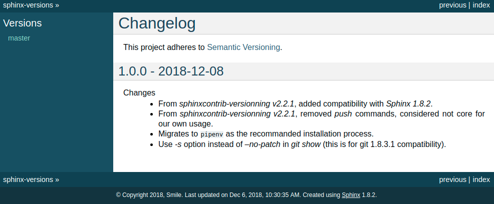
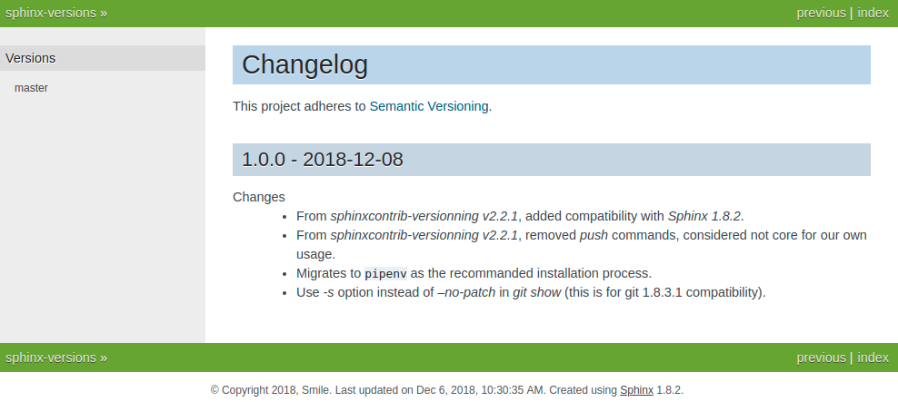

=========================
sphinx-versions |version|
=========================

A Sphinx extension that lets you build Sphinx docs for all versions of your project without needing special hosting
services.

+--------------------+--------------------+
| **A Few Examples**                      |
+--------------------+--------------------+
| *alabaster*        | *sphinx_rtd_theme* |
|                    |                    |
| |alabaster|        | |sphinx_rtd_theme| |
+--------------------+--------------------+
| *classic*          | *nature*           |
|                    |                    |
| |classic|          | |nature|           |
+--------------------+--------------------+

.. |alabaster|          image:: screenshots/alabaster.png
   :target:                 _images/alabaster.png
.. |sphinx_rtd_theme|   image:: screenshots/sphinx_rtd_theme.png
   :target:                 _images/sphinx_rtd_theme.png

Project Links
=============

* Documentation: https://sphinx-versions.readthedocs.io
* Source code: https://github.com/Smile-SA/sphinx-versions

.. toctree::
    :maxdepth: 2
    :caption: General

    install
    tutorial
    banner
    settings
    context
    themes

.. toctree::
    :maxdepth: 1
    :caption: Appendix

    contributing
    changelog
